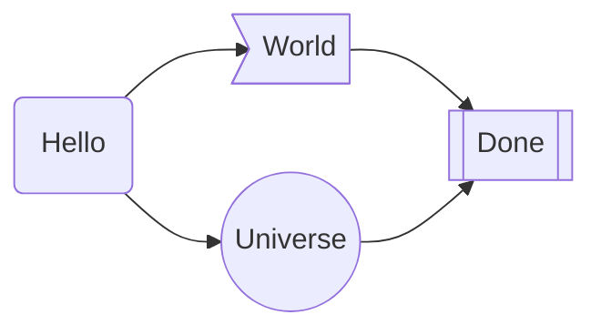

test-repo
=========

data science coursera test repo

```mermaid
  graph TD;
      A-->B;
      A-->C;
      B-->D;
      C-->D;
```

```mermaid
  flowchart LR;
	  Hello(Hello) --> World>World];
    Hello --> Universe((Universe));
    World --> Done[[Done]];
    Universe --> Done;
```
